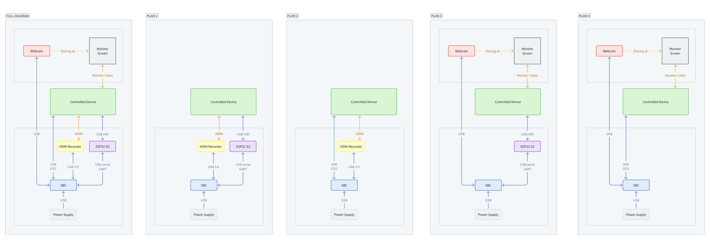

# OpenKVM

DIY KVM device for remote-controlling a computer. `KVM` stands for `Keyboard & Video & Mouse`.

A side system on a rackmount server,
[`IPMI`](https://en.wikipedia.org/wiki/Intelligent_Platform_Management_Interface) in `Dell Server` for example.

Just like the [MIT license](./LICENSE) says, no warranty or guarantee.  
**And do _NOT_ use for any illegal purposes.**

### TODO
- [ ] Long time test on SBC
- [ ] VNC authentication
  - DES encryption in Golang can NOT directly apply to [`VNC Authentication`](https://datatracker.ietf.org/doc/html/rfc6143#section-7.1.2)
- [ ] More effective to calculate the difference between frames
  - Balance between the power of SBC and the network efficiency
  - Or achieve more support for noVNC, beyond [rfc6143](https://datatracker.ietf.org/doc/html/rfc6143)
- [ ] Device filter for USB devices

## Dev Environment

### Hardware

**_NONE_ of them is sponsored, use them at your own risk!**

Essential hardware are:

- A computer that can run [Golang](https://go.dev/)
    - An old computer
    - SBC
        - [RaspberryPi](https://www.raspberrypi.com/)
        - [OrangePi](https://www.orangepi.org/)
        - [BTT-Pi](https://bigtree-tech.com/blogs/news/new-release-bigtreetech-btt-pi)
        - etc...
    - Maybe an Android phone?
- `HDMI Recorder`
    - ~~The common seen `HDMI Recorder` is a `USB 3.0` device.  
      There is only blank data from the `HDMI Recorder` on a `USB 2.0` port.  
      It seems that this is the problem of the `HDMI Recorder` itself,  
      the `HDMI Recorder` I bought can NOT work on Linux (Debian ARM or Ubuntu 24.04) even with a `USB 3.0` port.  
      Then, on the selection of SBC, beware of the support of `USB 3.0`.~~
      - This should be the problem with HDMI recorder itself of the driver in Linux,  
        I am lack of the knowledge of the driver in Linux, but I might find a solution for it:
        ```shell
        # Display all USB device, make sure the HDMI recorder is in 480M or above
        lsusb -t
        # /:  Bus 01.Port 1: Dev 1, Class=root_hub, Driver=xhci-hcd/1p, 480M
        #     |__ Port 1: Dev 3, If 0, Class=Video, Driver=uvcvideo, 480M
        #     |__ Port 1: Dev 3, If 1, Class=Video, Driver=uvcvideo, 480M
        #     |__ Port 1: Dev 3, If 2, Class=Audio, Driver=snd-usb-audio, 480M
        #     |__ Port 1: Dev 3, If 3, Class=Audio, Driver=snd-usb-audio, 480M
        
        # Get the id of the USB device
        lsusb
        # Bus 001 Device 003: ID 1de1:f105 Actions Microelectronics Co. Hagibis
        
        # Reset the USB device
        # Replace this with the id or the name of your USB device. 
        # For me, this is `Hagibis` or `1de1:f105`
        usbreset Hagibis
        
        # Capture one frame from device
        v4l2-ctl --verbose \
        --device=/dev/video0 \
        --stream-mmap \
        --stream-count=0 \
        --stream-to=frame.jpg \
        --set-fmt-video="width=640,height=480,pixelformat=MJPG"
        
        # Without resetting the USB device, there will be some error message in `dmesg` command
        # Non-zero status (-71) in video completion handler.
        
        # Here are some helpful commands
        # List all video devices
        v4l2-ctl --list-devices
        # List all supported formats for a video device
        v4l2-ctl --list-formats -d [device name or path or index] # v4l2-ctl --list-formats -d 0
        # List all supported frame sizes
        v4l2-ctl --list-framesizes [pixel format] -d [device] # v4l2-ctl --list-framesizes MJPEG -d 0
        ```
    - Or a `webcam` with an always-on monitor.
        - I know...this is a stupid way -- pointing a camera to a screen.
- Keyboard & Mouse Emulator
    - ESP32-S3
    - ESP32-S2
    - Arduino?
    - Some other device that supports USB HID output.
        - HID over BLE is not recommended, because it may not work in BIOS.

#### Set One

- `SBC`: [BTT-Pi](https://bigtree-tech.com/blogs/news/new-release-bigtreetech-btt-pi)
    - [GitHub](https://github.com/bigtreetech/BTT-Pi)
    - BTT-Pi **DOES NOT** support `USB 3.0`.
    - `¥158 RMB` ≈ `$22.5 USD`
- `Webcam & Monitor`: An old `webcam` and a monitor.
    - I don't think these stuffs should be detailed 😂.
- `Keyboard & Mouse`: [ESP32-S3](https://docs.espressif.com/projects/esp-idf/en/latest/esp32s3/hw-reference/esp32s3/user-guide-devkitc-1.html)
    - I bought a third-party one of [WeAct ESP32 S3 (A) DevKitC 1](https://github.com/WeActStudio).
    - `¥52 RMB` ≈ `$7.5 USD`

#### Set Two

- `SBC`: [OrangePi 3 LTS](http://www.orangepi.cn/html/hardWare/computerAndMicrocontrollers/details/Orange-Pi-3-LTS.html)
    - `¥241 RMB` ≈ `$34 USD`
- `HDMI Recorder`: [hagibis UHC07](https://cn.hagibis.com/products-p00222p1.html)
    - `¥69 RMB` ≈ `$10 USD`
- `Keyboard & Mouse`: [ESP32-S3](https://docs.espressif.com/projects/esp-idf/en/latest/esp32s3/hw-reference/esp32s3/user-guide-devkitc-1.html)
    - [WeAct ESP32 S3 (A) DevKitC 1](https://github.com/WeActStudio).
    - `¥52 RMB` ≈ `$7.5 USD`

#### Others

- Test Device:
    - [RaspberryPi 2B](https://www.raspberrypi.com/products/raspberry-pi-2-model-b/)
    - A Windows computer
- Some SD cards.
- Some `USB Type-C2C/C2A` cables.
- A `HDMI` cable.
- Some power supplies.

At minimal, it costs about `¥400 RMB` ≈ `60 USD`.  
_**Price is for reference only, the actual price may vary.**_

### Software

- [GO](https://go.dev/)
- [OpenCV](https://opencv.org/)
- [PlatformIO](https://platformio.org/)

## Diagram

[飞书文档](https://qi58or3rjjg.feishu.cn/wiki/KTZewFOx9iRyzQkfdzTcu8linxc?from=from_copylink)



## Run

### Debian ARM64

1. Install GO dev kit
   ```shell
   sudo apt-get update
   sudo apt-get install -y wget curl ffmpeg v4l-utils
   GO_ZIP="go1.22.3.linux-arm64.tar.gz"
   wget "https://go.dev/dl/$GO_ZIP"
   sudo rm -rf /usr/local/go && sudo tar -C /usr/local -xzf "$GO_ZIP"
   ```
2. Pull this repo
   ```shell
   sudo apt-get update
   sudo apt-get install -y git
   git clone https://github.com/allape/openkvm.git
   ```
3. Install OpenCV
    - Method 1: Install from APT
       ```shell
       sudo apt-get update
       sudo apt-get install -y build-essential g++ cmake pkg-config unzip libopencv-dev
       
       # But in BTT-Pi, it is only up tp v4.5.1
       # Then, I have to change the version of `gocv.io/x/gocv` to corresponding version
       sed -i 's/gocv.io\/x\/gocv v0.36.1/gocv.io\/x\/gocv opencv-4.5.1/g' openkvm/go.mod
       ```
    - Method 2: Build OpenCV from source  
      This may cost over 10 hours to build on BTT-Pi, I crashed at 96% :(  
      https://docs.opencv.org/4.x/d7/d9f/tutorial_linux_install.html
      ```shell
      mkdir opencv4 && cd opencv4
      wget -O opencv.zip https://github.com/opencv/opencv/archive/4.x.zip
      unzip opencv.zip
      mkdir -p build && cd build
      cmake ../opencv-4.x
      cmake --build .
      ```
4. Get noNVC
   ```shell
   git clone --depth 1 https://github.com/novnc/noVNC.git
   
   # [Optional] You can run noVNC separately
   python3 -m http.server --directory noVNC/ 8081
   ```
5. Flash ESP32-S3
   - Open folder [km/esp32s3](./km/esp32s3) of this project in [VSCode](https://code.visualstudio.com/)
   - After installing [PlatformIO](https://marketplace.visualstudio.com/items?itemName=platformio.platformio-ide) extension
     - Go to `PlatformIO` Tab
     - `PROJECT TASKS` -> `Default` -> `General` -> `Upload`
     - Or open `command palette` and type `PlatformIO: Upload`
       - `⌘ + shift + p` on macOS to open command palette
       - `ctrl + shift + p` on Windows or Ubuntu
6. Run or build repo
   ```shell
   cd openkvm
   cp kvm.toml.tpl kvm.toml
   
   # Find out serial port
   dmesg | grep tty
   
   # Edit this file to apply your settings
   vim kvm.toml 
   
   # Should run with super user privilege
   sudo go run .
   ```
7. Open browser and go to http://ip:8080/vnc.html, then click `Connect`
   - Hostname and port may vary depending on your settings

# Credits

- [Listed in go.mod](./go.mod)
- [Roboto Font](https://fonts.google.com/specimen/Roboto/about)
- [noVNC](https://github.com/novnc/noVNC)
- [PlatformIO](https://platformio.org/)
- [ESP-IDF](https://docs.espressif.com/projects/esp-idf/en/latest/esp32s3/get-started/index.html)
- [ESP32-Arduino](https://docs.espressif.com/projects/arduino-esp32/en/latest/getting_started.html)
- [Raspberry Pi Imager](https://www.raspberrypi.com/software/)
- [KeyMap](https://github.com/qemu/keycodemapdb)
